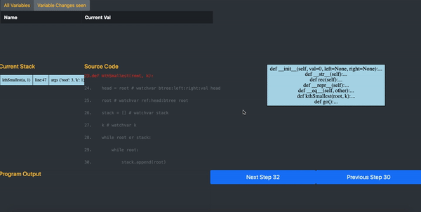

# Algorithm flow Visualizer


Welcome to Algorithm Flow Visualizer ! 

The flowchart visualizer attempts to do the following : Given a function to visualize , it breaks it down into every step of its.

It adds visualizations for stack trace ,and visualizations of data structures like trees.
It alse shows the control flow jumps being made with every step . This aims to give the programmer a great deal of help in 
visualizing the flow of a program.

 


### Current Installation instructions

Requires python 3.6 or higher, due to use of f-strings

```
pip3 install - r requirements.txt
sudo apt-get install graphviz
```

### Current Runtime instructions of the webapp:

* To see how to mark variables for tracing via interactive comments: See bottom


``` 
python3 flowview/manage.py runserver >log
```

* Go to http://127.0.0.1:8000/viewer
    
* Enter path to file and function to run

Steps to mark variables for variable tracing 
    
```python
# Normal Variables :

x = 0 # watchvar x

# Attributes of classes 

node.neighbours = [node1,node2] # watchvar node.neighbours
class Node:
    def __init__(self, val):
        self.val = val
        self.right = None
        self.left = None
class FullNode:
    def __init__(self, val):
        self.data = val
        self.children = []
# Visualizing BinaryTrees:
  root = Node(2) # watchvar btree:left:right:val root
# Adding a referrer to the binary tree : only for binary trees
   root_ref = root # watchvar ref:root:btree root_ref
# Visualizing trees with N nodes:
 root = FullNode(1) # watchvar tree:children:data root
   
   
     
```
   Important parameters to note above
   
   * ```# watchvar btree:left:right:val root```
   
   left : The attribute to the left node of the given node
   
   right : The attribute to the right node of the given node
   
   val : The attribute to the value stored in the node , this node stores 
   
   The attribute is accessed by getattr , ie
   ``` getattr(root,'left')``` -> gives object to the left node
   
   ``` getattr(root,'right')``` -> gives object to the right node
   If you change the attribute , from 'left' to lets say 'node1', then the comment attached would change 
   accordingly : ```# watchvar btree:node1:right:val root```
   
   Similarly:
   
   * ```# watchvar tree:children:data root``` 
   
   children : attribute to iterable of children of node
   
   data: attribute to the data of the node
   
   * ```# watchvar ref:root:btree root_ref```
   
   ref : shows a reference being defined
   root : name of variable tree to refer to 
   btree : type of tree of variable
   root_ref : name of variable to watch for

Important Limitations :

* The attribute based tracing works cannot to be extended to multiple levels of attributes (as in , attributes of attributes cant be marked for tracing) of the referenced object :
 ie : it wont work for comments like ```watchvar self.x.y```.

* Multiline expressions are not supported  of the sort ```rec(i,j) = rec(i-1,j-1) + rec(i-2,j-2)```.
One function call per line is supported. Calls of these sort can be broken down into

``` 
    s1 = rec(i-1,j-1) 
    s2 = rec(i-1,j-1)
    rec(i,j) = s1 + s2
```

For control flow graph visualizations: 

I am currently using the [my public fork of StatiCfg](https://github.com/vishwesh-D-kumar/staticfg).
 