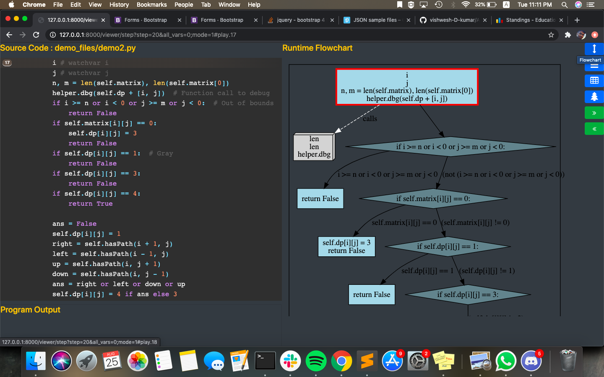
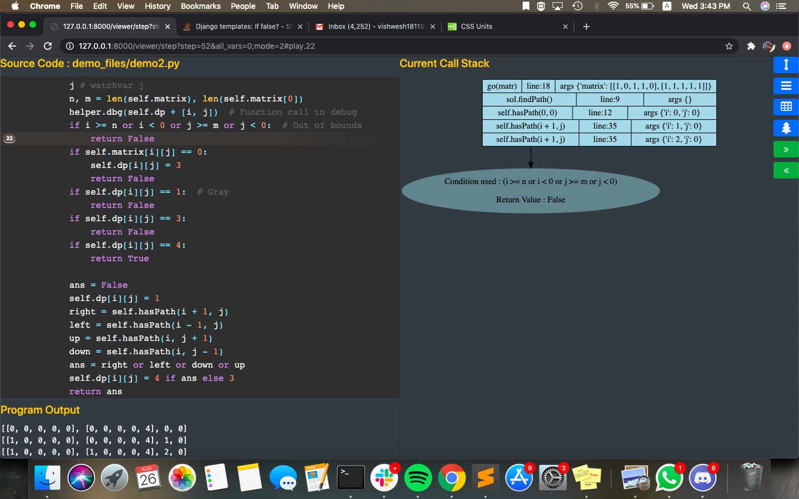
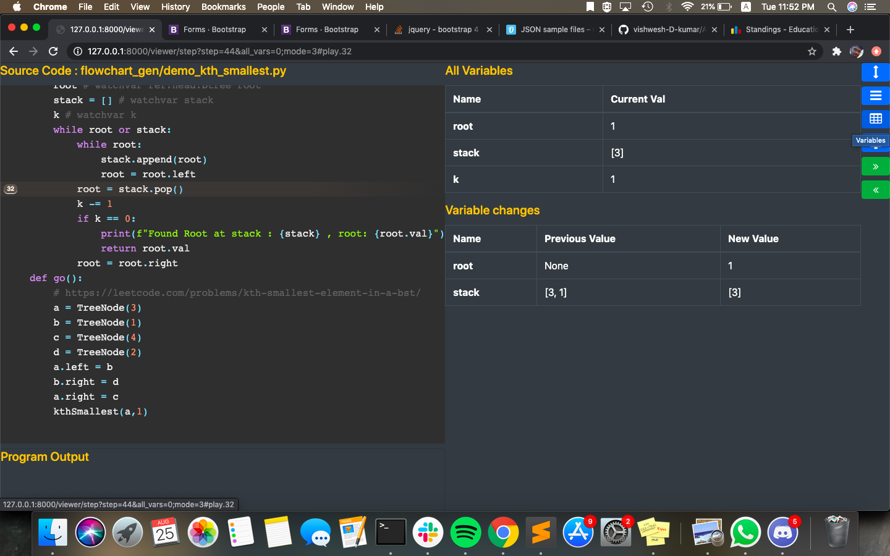
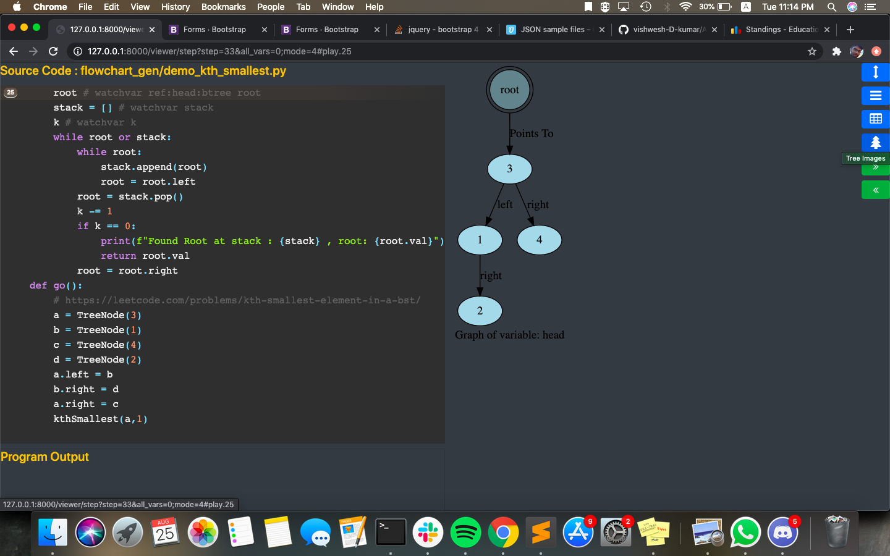

# Algorithm flow Visualizer


Welcome to Algorithm Flow Visualizer ! 

The flowchart visualizer attempts to do the following : Given a function to visualize , it breaks it down into every step of its.

It adds visualizations for stack trace ,and visualizations of data structures like trees.
It alse shows the control flow jumps being made with every step . This aims to give the programmer a great deal of help in 
visualizing the flow of a program.


### Current Installation instructions

Requires python 3.6 or higher, due to use of f-strings

```
pip3 install - r requirements.txt
sudo apt-get install graphviz
```

### Current Runtime instructions of the webapp:

* To see how to mark variables for tracing via interactive comments: See bottom


``` 
python3 flowview/manage.py runserver >log
```

* Go to http://127.0.0.1:8000/viewer
    
* Enter path to file and function to run

* You can also keep a config json file handy , which would avoid the hassle of reentering the same 

Configuration of the json file :

Fields :
```json
  {
  "file": "path/to/file",
  "function":"name of function",
  "included_files": ["paths","to","be","included"]
}
```
included files is a list of all files you want to include. This is to avoid the debugger going into all files that the program visits , potentially saving the programmer a lot of time , and the debugger a lot of computations.

If included files is left empty : It will not ignore any files.

A sample [config](config1.json) is provided.

A look at how to use all options of the debugger, listed at the rightmost part of the page. Just hover over the option to see what clicking the icon leads to !

A look at how each mode looks 

* Flowchart Visualization




The current block being visited is highlighted with a red block
 , and the last control flow jump made is also highlighted in red

* Stack Trace Visualization:



The Stack trace is visualized in the following manner :
```
Function Called As|line called at | Values of arguments called
```

lets take this function call as an example 
```python
 72. l(i+1,j-1)

 #and the functiondef of l is 
 def l(x,y)
```
assuming the value of i+1 is 20 , j-1 is 32 , lets say , the corresponding stack entry would be in this format :

```
l(i+1,j-1)|line 72| args {'x':20,'y':32}
```
Corresponding to every return : we have a bubble containing the following attached to the stack entry to be popped

1. Return value of the function call

2. Conditional evaluated to get to return statement. This is exceptionally helpful in visualizing recursive dp algorithms, where the base case used can be seen corresponding to stack popped.

As can be seen in the image shown as a demo: the condtional used is ``` i >= n or i < 0 or j >= m or j < 0: ```
With a return value of False

* Variable Tracing :



Steps to mark variables for variable tracing 
    

```python

# Normal Variables :

x = 0 # watchvar x

# Attributes of classes 

node.neighbours = [node1,node2] # watchvar node.neighbours
```


Once a variable is marked for tracing, it will be traced through all function calls that are made : provided either of the two conditions are satisfied 

* The variable is mutable 

* The variable is passed as an argument to the function call

* The object the variable is bound to , is passed as an argument to the call


* Tree Visualizations : 



Steps to mark trees for visualizations , and adding referrers
    
```python

class Node:
    def __init__(self, val):
        self.val = val
        self.right = None
        self.left = None
class FullNode:
    def __init__(self, val):
        self.data = val
        self.children = []
# Visualizing BinaryTrees:
  root = Node(2) # watchvar btree:left:right:val root
# Adding a referrer to the binary tree : only for binary trees
   root_ref = root # watchvar ref:root:btree root_ref
# Visualizing trees with N nodes:
 root = FullNode(1) # watchvar tree:children:data root
   
   
     
```
   Important parameters to note above
   
   * ```# watchvar btree:left:right:val root```
   
   left : The attribute to the left node of the given node
   
   right : The attribute to the right node of the given node
   
   val : The attribute to the value stored in the node , this node stores 
   
   The attribute is accessed by getattr , ie
   ``` getattr(root,'left')``` -> gives object to the left node
   
   ``` getattr(root,'right')``` -> gives object to the right node
   If you change the attribute , from 'left' to lets say 'node1', then the comment attached would change 
   accordingly : ```# watchvar btree:node1:right:val root```
   
   Similarly:
   
   * ```# watchvar tree:children:data root``` 
   
   children : attribute to iterable of children of node
   
   data: attribute to the data of the node
   
   * ```# watchvar ref:root:btree root_ref```
   
   ref : shows a reference being defined
   root : name of variable tree to refer to 
   btree : type of tree of variable
   root_ref : name of variable to watch for

Important Limitations :

* The attribute based tracing works cannot to be extended to multiple levels of attributes (as in , attributes of attributes cant be marked for tracing) of the referenced object :
 ie : it wont work for comments like ```watchvar self.x.y```.
* Do not use multiline expressions while making function calls
``` go([[1,2,3],
          [1,2,3]])
          # will raise an error
    go([[1,2,3],[1,2,3]]) # won't raise an error
```
* Multiexpression Lines are not supported  of the sort ```rec(i,j) = rec(i-1,j-1) + rec(i-2,j-2)```.
One function call per line is supported. Calls of these sort can be broken down into

``` 
    s1 = rec(i-1,j-1) 
    s2 = rec(i-1,j-1)
    rec(i,j) = s1 + s2
```

For control flow graph visualizations: 

I am currently using the [my public fork of StatiCfg](https://github.com/vishwesh-D-kumar/staticfg).

This [PR](https://github.com/coetaur0/staticfg/pull/13) has been sent also , containing general purpose improvements.

[UPDATE] The above PR has been merged into master of StatiCfg !

 